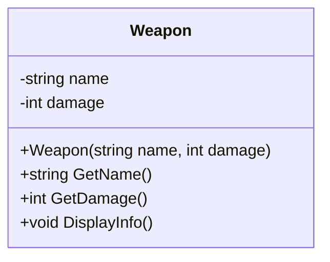
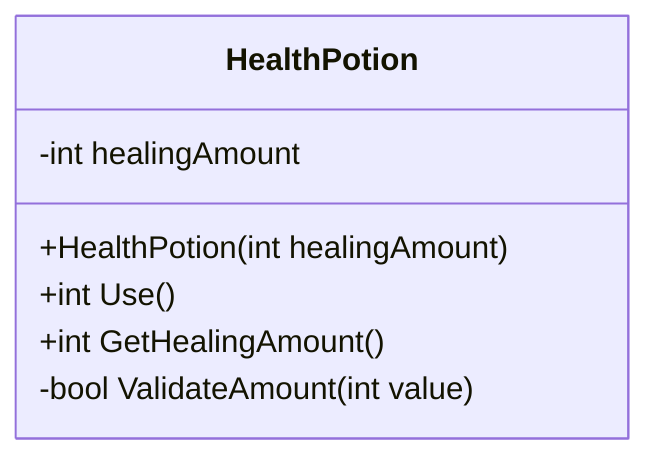
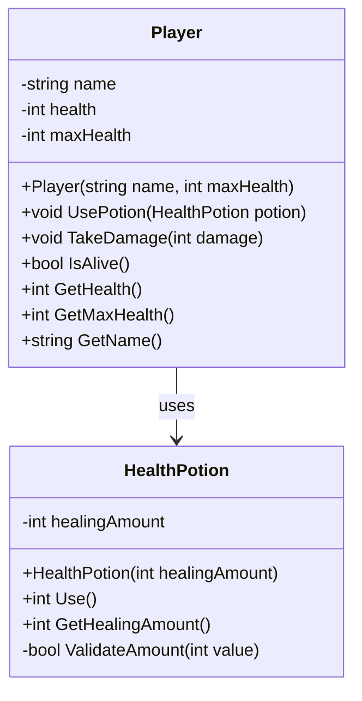

# 🎮 Chapitre 1 : Classes de Base - Solutions

## 🎯 Solution Exercice 1 : Weapon

### Diagramme UML


### Code C#
```csharp
public class Weapon
{
    private string name;
    private int damage;

    public Weapon(string name, int damage)
    {
        this.name = name;
        this.damage = damage;
    }

    public string GetName() => name;
    public int GetDamage() => damage;

    public void DisplayInfo()
    {
        Console.WriteLine($"Arme : {name} - Dégâts : {damage}");
    }
}
```

---

## 🎯 Solution Exercice 2 : HealthPotion

### Diagramme UML


### Code C#
```csharp
public class HealthPotion
{
    private int healingAmount;

    public HealthPotion(int healingAmount)
    {
        if (!ValidateAmount(healingAmount))
            throw new ArgumentException("La quantité de guérison doit être entre 0 et 100");
        
        this.healingAmount = healingAmount;
    }

    public int Use()
    {
        Console.WriteLine($"Potion utilisée ! Guérison : {healingAmount}");
        return healingAmount;
    }

    public int GetHealingAmount() => healingAmount;

    private bool ValidateAmount(int value)
    {
        return value >= 0 && value <= 100;
    }
}
```

---

## 🎯 Solution Exercice 3 : Player et HealthPotion

### Diagramme UML


### Code C#
```csharp
public class Player
{
    private string name;
    private int health;
    private int maxHealth;

    public Player(string name, int maxHealth)
    {
        this.name = name;
        this.maxHealth = maxHealth;
        this.health = maxHealth;
    }

    public void UsePotion(HealthPotion potion)
    {
        int healing = potion.Use();
        health = Math.Min(health + healing, maxHealth);
        Console.WriteLine($"{name} se soigne de {healing} points. Santé : {health}/{maxHealth}");
    }

    public void TakeDamage(int damage)
    {
        health = Math.Max(health - damage, 0);
        Console.WriteLine($"{name} prend {damage} dégâts. Santé : {health}/{maxHealth}");
    }

    public bool IsAlive() => health > 0;
    
    public int GetHealth() => health;
    public int GetMaxHealth() => maxHealth;
    public string GetName() => name;
}
```

---

## 🎯 Programme Principal

### Code C#
```csharp
class Program
{
    static void Main(string[] args)
    {
        Console.WriteLine("=== Chapitre 1 : Classes de Base ===");
        
        // Test de la classe Weapon
        Console.WriteLine("\n--- Test Weapon ---");
        Weapon sword = new Weapon("Épée en fer", 25);
        Weapon axe = new Weapon("Hache de guerre", 35);
        
        sword.DisplayInfo();
        axe.DisplayInfo();
        
        // Test de la classe HealthPotion et Player
        Console.WriteLine("\n--- Test HealthPotion et Player ---");
        Player hero = new Player("Hero", 100);
        HealthPotion potion = new HealthPotion(30);
        
        Console.WriteLine($"État initial : {hero.GetName()} - Santé : {hero.GetHealth()}/{hero.GetMaxHealth()}");
        
        hero.TakeDamage(50);  // Le héros prend des dégâts
        hero.UsePotion(potion); // Le héros utilise la potion
        
        Console.WriteLine($"État final : {hero.GetName()} - Santé : {hero.GetHealth()}/{hero.GetMaxHealth()}");
        Console.WriteLine($"Le héros est-il vivant ? {hero.IsAlive()}");
    }
}
``` 