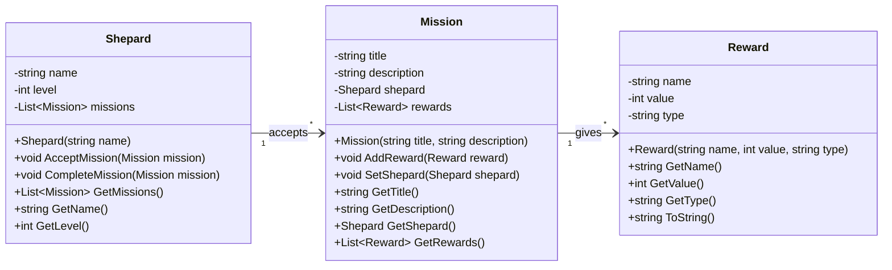
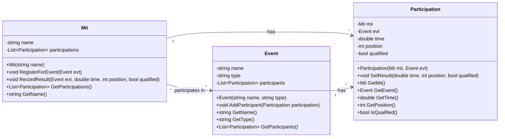

# 🎮 Chapitre 2 : Relations entre Classes - Solutions

## 🎯 Solution Exercice 1 : Mass Effect - Système de Missions

### Diagramme UML


### Code C#
```csharp
// Shepard.cs
public class Shepard
{
    private string name;
    private int level;
    private List<Mission> missions;

    public Shepard(string name)
    {
        this.name = name;
        this.level = 1;
        this.missions = new List<Mission>();
    }

    public void AcceptMission(Mission mission)
    {
        if (mission != null && !missions.Contains(mission))
        {
            missions.Add(mission);
            mission.SetShepard(this);
            Console.WriteLine($"{name} a accepté la mission : {mission.GetTitle()}");
        }
    }

    public void CompleteMission(Mission mission)
    {
        if (missions.Contains(mission))
        {
            var rewards = mission.GetRewards();
            Console.WriteLine($"{name} a terminé la mission : {mission.GetTitle()}");
            Console.WriteLine("Récompenses reçues :");
            foreach (var reward in rewards)
            {
                Console.WriteLine($"- {reward.GetName()}: {reward.GetValue()}");
            }
            missions.Remove(mission);
        }
    }

    public List<Mission> GetMissions() => new List<Mission>(missions);
    public string GetName() => name;
    public int GetLevel() => level;
}

// Mission.cs
public class Mission
{
    private string title;
    private string description;
    private Shepard shepard;
    private List<Reward> rewards;

    public Mission(string title, string description)
    {
        this.title = title;
        this.description = description;
        this.rewards = new List<Reward>();
    }

    public void AddReward(Reward reward)
    {
        if (reward != null && !rewards.Contains(reward))
        {
            rewards.Add(reward);
        }
    }

    public void SetShepard(Shepard shepard)
    {
        this.shepard = shepard;
    }

    public string GetTitle() => title;
    public string GetDescription() => description;
    public Shepard GetShepard() => shepard;
    public List<Reward> GetRewards() => new List<Reward>(rewards);
}

// Reward.cs
public class Reward
{
    private string name;
    private int value;
    private string type;

    public Reward(string name, int value, string type)
    {
        this.name = name;
        this.value = value;
        this.type = type;
    }

    public string GetName() => name;
    public int GetValue() => value;
    public string GetType() => type;

    public override string ToString()
    {
        return $"{name} ({type}): {value}";
    }
}
```

---

## 🎯 Solution Exercice 2 : Wii Sports - Système d'Athlétisme

### Diagramme UML


### Code C#
```csharp
// Mii.cs
public class Mii
{
    private string name;
    private List<Participation> participations;

    public Mii(string name)
    {
        this.name = name;
        this.participations = new List<Participation>();
    }

    public void RegisterForEvent(Event evt)
    {
        if (evt != null)
        {
            var participation = new Participation(this, evt);
            participations.Add(participation);
            evt.AddParticipant(participation);
            Console.WriteLine($"{name} s'est inscrit à l'épreuve : {evt.GetName()}");
        }
    }

    public void RecordResult(Event evt, double time, int position, bool qualified)
    {
        var participation = participations.Find(p => p.GetEvent() == evt);
        if (participation != null)
        {
            participation.SetResult(time, position, qualified);
            Console.WriteLine($"{name} - {evt.GetName()}: Temps {time}s, Position {position}, Qualifié: {qualified}");
        }
    }

    public List<Participation> GetParticipations() => new List<Participation>(participations);
    public string GetName() => name;
}

// Event.cs
public class Event
{
    private string name;
    private string type;
    private List<Participation> participants;

    public Event(string name, string type)
    {
        this.name = name;
        this.type = type;
        this.participants = new List<Participation>();
    }

    public void AddParticipant(Participation participation)
    {
        if (participation != null && !participants.Contains(participation))
        {
            participants.Add(participation);
        }
    }

    public string GetName() => name;
    public string GetType() => type;
    public List<Participation> GetParticipants() => new List<Participation>(participants);
}

// Participation.cs
public class Participation
{
    private Mii mii;
    private Event evt;
    private double time;
    private int position;
    private bool qualified;

    public Participation(Mii mii, Event evt)
    {
        this.mii = mii;
        this.evt = evt;
        this.time = 0;
        this.position = 0;
        this.qualified = false;
    }

    public void SetResult(double time, int position, bool qualified)
    {
        this.time = time;
        this.position = position;
        this.qualified = qualified;
    }

    public Mii GetMii() => mii;
    public Event GetEvent() => evt;
    public double GetTime() => time;
    public int GetPosition() => position;
    public bool IsQualified() => qualified;
}
```

---

## 🎯 Programme Principal

### Code C#
```csharp
class Program
{
    static void Main(string[] args)
    {
        Console.WriteLine("=== Chapitre 2 : Relations entre Classes ===");
        
        // Test Mass Effect
        Console.WriteLine("\n--- Test Mass Effect ---");
        Shepard shepard = new Shepard("Commander Shepard");
        
        Mission mission1 = new Mission("Rescatar colonos", "Salvar a los colonos de los ataques");
        mission1.AddReward(new Reward("Crédits", 5000, "Monnaie"));
        mission1.AddReward(new Reward("XP", 100, "Expérience"));
        
        shepard.AcceptMission(mission1);
        shepard.CompleteMission(mission1);
        
        // Test Wii Sports
        Console.WriteLine("\n--- Test Wii Sports ---");
        Mii mii1 = new Mii("Mon Mii");
        Event event1 = new Event("100m", "Course");
        
        mii1.RegisterForEvent(event1);
        mii1.RecordResult(event1, 12.5, 3, true);
    }
} 