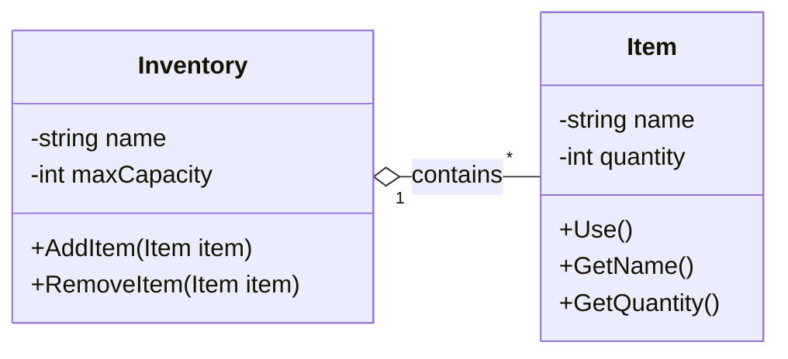
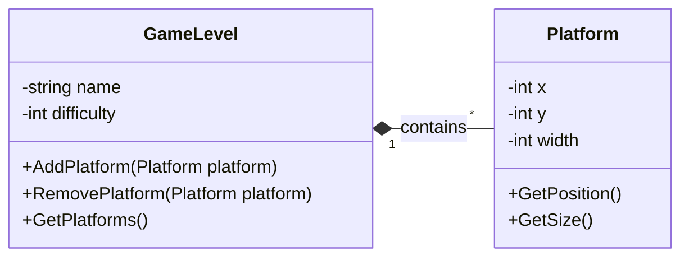

# 🎮 Chapitre 3. Relations entre Classes : Agrégation et Composition

Ce chapitre se concentre sur les **relations de contenu** entre classes : l'agrégation et la composition. Ces relations représentent des liens de **propriété** où une classe contient d'autres classes.

## 🔗 Agrégation (Aggregation)

### Définition
L'**agrégation** représente une relation "a un" où une classe contient d'autres objets, mais ces objets peuvent exister indépendamment du container. La suppression du container **ne détruit pas** les objets contenus.

### Représentation UML
- **Symbole** : Losange vide (◇)
- **Relation** : "a un" ou "contient"
- **Cardinalité** : Container "1" → Contenu "*"

### Exemple : Inventaire et Objets

**Contexte** : Dans **Minecraft**, un inventaire contient des objets. Si l'inventaire est supprimé, les objets peuvent être transférés vers un autre inventaire ou tomber au sol, mais ils continuent d'exister.

**Jeu de référence** : Minecraft - Quand un inventaire est détruit, les objets peuvent être récupérés et placés dans un autre inventaire.



### Implémentation : Structures de données

```csharp
public class Inventory
{
    // ... autres attributs ...
    private List<Item> items;  // ← Référence vers liste externe (agrégation)
    
    public Inventory(List<Item> initialItems)
    {
        this.items = initialItems;  // ← Injection de dépendance
    }
    
    public void SetItems(List<Item> newItems)
    {
        this.items = newItems;  // ← Changement de référence
    }
}

public class Item
{
    // ... autres attributs ...
    // Pas de référence vers Inventory (indépendance)
}
```

### Caractéristiques de l'Agrégation

1. **Indépendance** : Les objets contenus peuvent exister sans le container
2. **Réutilisabilité** : Les objets peuvent être transférés entre containers
3. **Survie** : La suppression du container ne détruit pas le contenu
4. **Flexibilité** : Relation moins forte que la composition

---

## 🔗 Composition

### Définition
La **composition** représente une relation "est composé de" où une classe contient d'autres objets qui **ne peuvent pas exister** sans le container. La suppression du container **détruit** automatiquement tous les objets contenus.

### Représentation UML
- **Symbole** : Losange plein (◆)
- **Relation** : "est composé de" ou "contient exclusivement"
- **Cardinalité** : Container "1" → Contenu "*"

### Exemple : Niveau de Jeu et Plateformes

**Contexte** : Dans **Super Mario Bros**, un niveau de jeu contient des plateformes. Si le niveau est supprimé, toutes les plateformes sont également supprimées car elles n'ont pas de sens sans le niveau.

**Jeu de référence** : Super Mario Bros - Chaque niveau contient ses propres plateformes, ennemis et objets. Quand on change de niveau, tout le contenu du niveau précédent disparaît.



### Implémentation : Structures de données

```csharp
public class GameLevel
{
    // ... autres attributs ...
    private List<Platform> platforms;  // ← Liste créée et gérée par le container
    
    public GameLevel()
    {
        this.platforms = new List<Platform>();  // ← Création interne
    }
    
    public void AddPlatform(Platform platform)
    {
        this.platforms.Add(platform);  // ← Gestion du cycle de vie
    }
}

public class Platform
{
    // ... autres attributs ...
    // Pas de référence vers GameLevel (dépendance forte)
}
```

### Caractéristiques de la Composition

1. **Dépendance forte** : Les objets contenus ne peuvent exister sans le container
2. **Destruction automatique** : Supprimer le container détruit le contenu
3. **Exclusivité** : Un objet ne peut appartenir qu'à un seul container
4. **Cohérence** : Le cycle de vie est géré par le container


## 🔗 Comparaison : Agrégation vs Composition

### Différence clé : Cycle de vie

| Aspect | Agrégation | Composition |
|--------|------------|-------------|
| **Existence** | Objets indépendants | Objets dépendants |
| **Destruction** | Container supprimé → Objets survivent | Container supprimé → Objets détruits |
| **Réutilisabilité** | Objets transférables | Objets non transférables |
| **Force de la relation** | Faible | Forte |

### Exemple concret : Système de Fichiers

**Agrégation** : Un dossier contient des fichiers
- Supprimer le dossier → Les fichiers existent encore (déplacés ou supprimés manuellement)

**Composition** : Un document contient des paragraphes
- Supprimer le document → Tous les paragraphes sont supprimés automatiquement

---

## 🎮 Exemples de Jeux Vidéo

### Agrégation dans les Jeux

1. **Inventaire de joueur** (Minecraft, Skyrim)
   - Le joueur contient des objets
   - Les objets survivent à la mort du joueur

2. **Équipe de joueurs** (Mario Kart)
   - L'équipe contient des joueurs
   - Les joueurs peuvent changer d'équipe

3. **Collection de cartes** (Hearthstone)
   - Le deck contient des cartes
   - Les cartes peuvent être réutilisées dans d'autres decks

### Composition dans les Jeux

1. **Niveau et éléments** (Super Mario Bros)
   - Le niveau contient plateformes, ennemis, objets
   - Supprimer le niveau supprime tout son contenu

2. **Personnage et composants** (RPG)
   - Le personnage contient système de santé, inventaire, équipement
   - Supprimer le personnage supprime tous ses composants

3. **Mission et objectifs** (GTA)
   - La mission contient des objectifs spécifiques
   - Terminer/annuler la mission supprime tous les objectifs

---

## 🔗 Avantages et Inconvénients

### Agrégation

**Avantages :**
- Flexibilité maximale
- Réutilisabilité des objets
- Gestion d'état indépendante

**Inconvénients :**
- Gestion de cycle de vie complexe
- Risque d'objets orphelins
- Logique de transfert nécessaire

### Composition

**Avantages :**
- Gestion automatique du cycle de vie
- Cohérence garantie
- Simplification de la logique

**Inconvénients :**
- Moins de flexibilité
- Objets non réutilisables
- **Couplage fort**!

---

## 🎯 Quand utiliser chaque relation ?

### Utiliser l'Agrégation quand :
- Les objets peuvent exister indépendamment
- Les objets peuvent être transférés
- La relation est temporaire ou optionnelle
- Exemple : Inventaire d'objets, équipe de joueurs

### Utiliser la Composition quand :
- Les objets n'ont pas de sens sans le container
- Le cycle de vie doit être géré automatiquement
- La relation est permanente et exclusive
- Exemple : Niveau et ses éléments, personnage et ses composants 