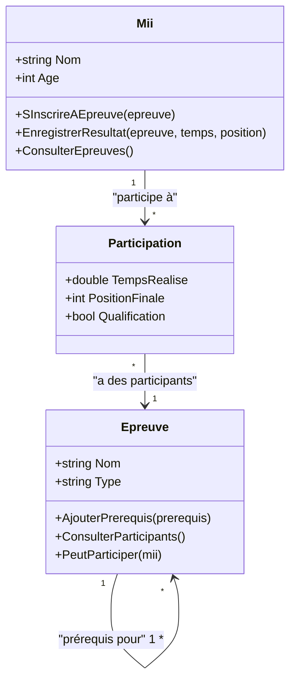

# 🎮 Diagramme UML - Exercice 2 : Système d'Athlétisme Wii Sports

## 🔗 Diagramme de Classes UML

## 📊 Explication des Relations

### 🔗 **Relation Many-to-Many avec Classe d'Association : Mii ↔ Épreuve**

**Cardinalité :** `1..*` ↔ `1..*`
- **Un Mii** peut participer à **plusieurs épreuves**
- **Une épreuve** peut avoir **plusieurs Miis** participants

**Implémentation dans le code :**
- **Classe `Mii`** : Liste `_participations` pour stocker les participations
- **Classe `Epreuve`** : Liste `_participations` pour stocker les participants
- **Classe `Participation`** : Classe d'association avec données spécifiques

**Données de la classe d'association :**
- `_tempsRealise` : Temps réalisé par le Mii
- `_positionFinale` : Position finale du Mii
- `_qualification` : Si le Mii s'est qualifié

### 🔄 **Relation Réflexive : Épreuve ↔ Épreuve**

**Cardinalité :** `0..*` ↔ `0..*`
- **Une épreuve** peut avoir **plusieurs épreuves** comme prérequis
- **Une épreuve** peut être prérequis pour **plusieurs épreuves**

**Implémentation dans le code :**
- **Classe `Epreuve`** : Liste `_prerequis` pour stocker les épreuves prérequises
- **Méthode `AjouterPrerequis()`** : Gestion des prérequis
- **Méthode `PeutParticiper()`** : Vérification des prérequis

## 🔧 Points Techniques Importants

### **Cohérence Bidirectionnelle**
- Quand un Mii s'inscrit à une épreuve, la participation est ajoutée dans les deux listes
- Maintien de l'intégrité référentielle entre les objets

### **Gestion des Prérequis**
- Vérification qu'une épreuve ne peut pas être prérequis d'elle-même
- Croisement des relations many-to-many et réflexive pour vérifier les qualifications

### **Classe d'Association**
- Encapsulation des données spécifiques à la relation Mii-Épreuve
- Permet d'ajouter facilement de nouvelles propriétés à la relation

