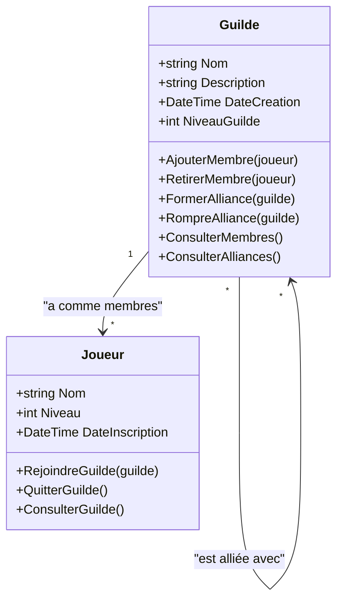

# 🎮 Diagramme UML - Exercice 3 : Système de Guildes et Membres

## 🔗 Diagramme de Classes UML

## 📊 Explication des Relations

### 🔗 **Relation One-to-Many : Guilde ↔ Joueur**

**Cardinalité :** `1` ↔ `0..*`
- **Une guilde** peut avoir **plusieurs joueurs** comme membres
- **Un joueur** ne peut appartenir qu'à **une seule guilde** à la fois (ou aucune)

**Implémentation dans le code :**
- **Classe `Guilde`** : Liste `_membres` pour stocker les joueurs membres
- **Classe `Joueur`** : Référence `_guilde` vers la guilde d'appartenance

### 🔄 **Relation Réflexive : Guilde ↔ Guilde**

**Cardinalité :** `0..*` ↔ `0..*`
- **Une guilde** peut avoir **plusieurs alliances** avec d'autres guildes
- **Une alliance** est bidirectionnelle (si A est alliée à B, alors B est alliée à A)

**Implémentation dans le code :**
- **Classe `Guilde`** : Liste `_alliances` pour stocker les guildes alliées
- **Méthode `FormerAlliance()`** : Création d'une alliance bidirectionnelle
- **Méthode `RompreAlliance()`** : Rupture d'une alliance bidirectionnelle

## 🔧 Points Techniques Importants

### **Contrainte de Cardinalité**
- Un joueur ne peut appartenir qu'à une seule guilde à la fois
- Vérification lors de l'ajout d'un membre pour éviter les appartenances multiples

### **Gestion des Alliances Bidirectionnelles**
- Maintien de la cohérence des alliances dans les deux sens
- Éviter les alliances réflexives (une guilde ne peut pas être alliée avec elle-même)

### **Gestion des Membres**
- Mise à jour automatique des références lors de l'ajout/retrait de membres
- Maintien de l'intégrité référentielle entre guildes et joueurs
