# 🎮 Diagramme UML - Système de Potions dans The Witcher

## 🔗 Diagramme de Classes UML

```mermaid
classDiagram
    %% Classe de base Ingredient
    class Ingredient {
        +string Name
        +string Description
    }
    
    %% Classe Potion qui hérite d'Ingredient (peut être utilisée comme ingrédient)
    class Potion {
        +int ComplexityLevel
        +string Effect
        +AddIngredient(ingredient, quantity, order)
        +GetIngredients()
        +CanBeCreated()
    }
    
    %% Classe BaseIngredient qui hérite d'Ingredient
    class BaseIngredient {
        +string Source
        +int Rarity
    }

    %% Classe d'association IngredientRecipe
    class IngredientRecipe {
        +int Quantity
        +int AddOrder
    }

    %% Relations d'héritage
    Ingredient <|-- Potion
    Ingredient <|-- BaseIngredient
    
    %% RELATION MANY-TO-MANY AVEC CLASSE D'ASSOCIATION
    Potion "*" -- "*" Ingredient
    IngredientRecipe -- Potion
    IngredientRecipe -- Ingredient
```

## 📊 Explication des Relations

### 🔄 **Hiérarchie d'héritage : Ingredient → Potion/BaseIngredient**

**Classe de base `Ingredient` :**
- Contient les propriétés communes à tous les ingrédients : nom et description
- Sert de classe abstraite pour les différents types d'ingrédients

**Classes dérivées :**
- **`Potion`** : Représente une potion qui peut être consommée et contenir d'autres ingrédients
- **`BaseIngredient`** : Représente un ingrédient de base comme "Alcohest", "Herbe de Griffon", etc.

### 🔄 **Relation Many-to-Many avec Classe d'Association : Potion ↔ Ingredient**

**Cardinalité :** 
- Une potion peut contenir plusieurs ingrédients (potions ou ingrédients de base)
- Un ingrédient peut être utilisé dans plusieurs potions

**Implémentation dans le code :**
- **Classe `Potion`** : 
  - Liste `_ingredients` pour stocker les ingrédients (potions ou ingrédients de base) utilisés dans cette potion

**Classe d'association `IngredientRecipe` :**
- Contient les informations spécifiques à chaque relation potion-ingrédient :
  - `_quantity` : Quantité nécessaire de l'ingrédient
  - `_addOrder` : Ordre dans lequel l'ingrédient doit être ajouté

## 🔧 Points Techniques Importants

### **Hiérarchie d'Héritage**
- `Ingredient` est la classe de base pour tous les types d'ingrédients
- `Potion` et `BaseIngredient` héritent d'`Ingredient`
- Cette structure permet de traiter de manière uniforme tous les types d'ingrédients

### **Flexibilité des Recettes**
- Une potion peut contenir comme ingrédients :
  - Des ingrédients de base (herbes, essences, etc.)
  - D'autres potions (pour créer des potions plus complexes)
  - Un mélange des deux
- Cette flexibilité permet de modéliser des recettes complexes comme dans le jeu

### **Gestion des Ingrédients**
- Chaque potion maintient une liste de ses ingrédients via la classe d'association
- La relation est unidirectionnelle : une potion connaît ses ingrédients, mais un ingrédient ne sait pas dans quelles potions il est utilisé
- Cette approche simplifie la gestion des relations tout en permettant de créer des potions complexes

### **Vérification de Création**
- La méthode `CanBeCreated()` vérifie si tous les ingrédients nécessaires sont disponibles
- Permet d'éviter les références circulaires (une potion qui nécessiterait elle-même comme ingrédient)
- Permet de déterminer si une potion peut être créée avec les ingrédients disponibles
