# 🎮 Diagramme UML - Système de Potions

## 🔗 Diagramme de Classes UML

**Attention**: c'est difficile (sinon impossible de fois) d'établir proprement le layout avec Mermaid. Observez que la classe AjoutIngredient se trouve au sommet de la hiérarchie, mais on n'hérite pas d'elle! Le diagramme est correct mais le layout pourrait être plus clair.

```mermaid
classDiagram
    %% Classe abstraite Ingredient
    class Ingredient {
        <<abstract>>
        +nom: string
        +description: string
        +GetInfo(): string
    }
    
    %% Classe AjoutIngredient (IngredientPotion dans l'énoncé)
    class AjoutIngredient {
        +quantite: int
        +ordreAjout: int
        +GetDetails(): string
    }
    
    %% Classe Potion qui hérite d'Ingredient
    class Potion {
        +nom: string
        +effet: string
        +complexite: int
        +AddIngredient(ingredient, quantite, ordre): void
        +GetIngredients(): List<AjoutIngredient>
        +CanBeCreated(): bool
    }
    
    %% Classe RawIngredient qui hérite d'Ingredient
    class RawIngredient {
        +source: string
        +rarete: int
        +GetSource(): string
    }

    %% Relations
    AjoutIngredient "*" -- "1" Ingredient : contient
    AjoutIngredient "1..*" -- "1" Potion : correspond
    Ingredient <|-- Potion : Extends
    Ingredient <|-- RawIngredient : Extends
```

## 📊 Explication des Relations

### 🔄 **Hiérarchie d'héritage : Ingredient → Potion/RawIngredient**

**Classe abstraite `Ingredient` :**
- Classe de base abstraite pour tous les types d'ingrédients
- Contient les propriétés et méthodes communes à tous les ingrédients

**Classes dérivées :**
- **`Potion`** : Représente une potion qui peut être consommée
- **`RawIngredient`** : Représente un ingrédient brut avec une source spécifique

### 🔄 **Relation entre AjoutIngredient, Potion et Ingredient**

**Cardinalité :** 
- Une instance d'`AjoutIngredient` contient exactement un `Ingredient` (relation 1 à 1)
- Un `Ingredient` peut être utilisé dans plusieurs instances d'`AjoutIngredient` (relation 1 à plusieurs)
- Une `Potion` peut avoir plusieurs instances d'`AjoutIngredient` (relation 1 à plusieurs)
- Une instance d'`AjoutIngredient` correspond à exactement une `Potion` (relation 1 à 1)

**Classe `AjoutIngredient` :**
- Contient les informations spécifiques à l'ajout d'un ingrédient dans une potion :
  - `quantite` : Quantité nécessaire de l'ingrédient
  - `ordreAjout` : Ordre dans lequel l'ingrédient doit être ajouté

## 🔧 Points Techniques Importants

### **Hiérarchie d'Héritage**
- `Ingredient` est la classe abstraite de base pour tous les types d'ingrédients
- `Potion` et `RawIngredient` héritent d'`Ingredient`
- Cette structure permet de traiter de manière uniforme tous les types d'ingrédients

### **Gestion des Ingrédients dans les Potions**
- La classe `AjoutIngredient` sert d'intermédiaire entre les potions et les ingrédients
- Elle permet de spécifier la quantité et l'ordre d'ajout de chaque ingrédient dans une potion
- Cette approche offre une grande flexibilité dans la création de recettes de potions

### **Flexibilité du Système**
- Une potion peut contenir différents types d'ingrédients (bruts ou autres potions)
- Le système permet de créer des recettes complexes avec des ordres d'ajout spécifiques
- La structure facilite l'extension du système avec de nouveaux types d'ingrédients
