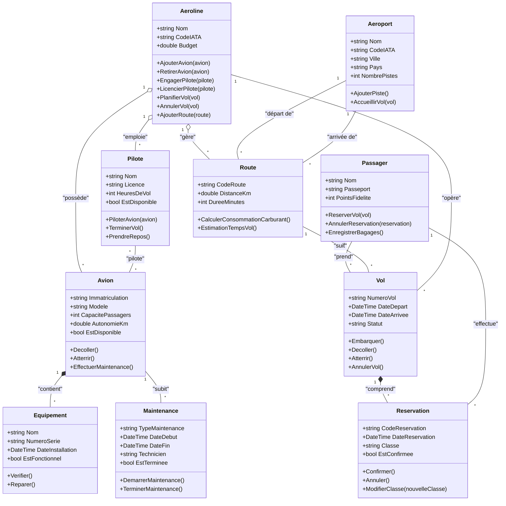

# 🎮 Diagramme UML - Exercice 1 : Système de Gestion d'Aéroline

## 🔗 Diagramme de Classes UML

## 📊 Explication des Relations

### 🔗 **Relation d'Agrégation : Aéroline ↔ Avion**

**Cardinalité :** `1` ↔ `*`
- **Une aéroline** possède **plusieurs avions**
- **Un avion** appartient à **une seule aéroline** à la fois
- C'est une agrégation car les avions peuvent exister indépendamment de l'aéroline (ils peuvent être vendus à une autre compagnie)

### 🔗 **Relation d'Agrégation : Aéroline ↔ Pilote**

**Cardinalité :** `1` ↔ `*`
- **Une aéroline** emploie **plusieurs pilotes**
- **Un pilote** travaille pour **une seule aéroline** à la fois
- C'est une agrégation car les pilotes peuvent exister indépendamment de l'aéroline (ils peuvent changer d'employeur)

### 🔗 **Relation de Composition : Avion ↔ Équipement**

**Cardinalité :** `1` ↔ `*`
- **Un avion** contient **plusieurs équipements**
- **Un équipement** appartient à **un seul avion**
- C'est une composition car les équipements sont généralement installés de façon permanente et leur cycle de vie est lié à celui de l'avion

### 🔗 **Relation d'Association : Pilote ↔ Avion**

**Cardinalité :** `*` ↔ `*`
- **Un pilote** peut piloter **plusieurs avions** (selon ses qualifications)
- **Un avion** peut être piloté par **plusieurs pilotes** (en rotation)

### 🔗 **Relation d'Association : Aéroport ↔ Route**

**Cardinalité :** `1` ↔ `*`
- **Un aéroport** peut être le point de départ de **plusieurs routes**
- **Un aéroport** peut être le point d'arrivée de **plusieurs routes**
- **Une route** a exactement **un aéroport de départ** et **un aéroport d'arrivée**

### 🔗 **Relation de Composition : Vol ↔ Réservation**

**Cardinalité :** `1` ↔ `*`
- **Un vol** comprend **plusieurs réservations**
- **Une réservation** est associée à **un seul vol**
- C'est une composition car une réservation ne peut pas exister sans le vol correspondant

### 🔗 **Relation d'Association : Route ↔ Vol**

**Cardinalité :** `1` ↔ `*`
- **Une route** peut être suivie par **plusieurs vols**
- **Un vol** suit exactement **une route**

### 🔗 **Relation d'Association : Avion ↔ Maintenance**

**Cardinalité :** `1` ↔ `*`
- **Un avion** peut subir **plusieurs maintenances** au cours de sa vie
- **Une maintenance** concerne **un seul avion**

## 🤔 Réponses aux Questions de Réflexion

### 1. **Vente d'avion : Comment modéliser le transfert d'un avion vers une autre aéroline ?**

Pour modéliser le transfert d'un avion vers une autre aéroline, on utiliserait les opérations suivantes :
1. L'aéroline source appelle sa méthode `RetirerAvion(avion)` qui rompt le lien d'agrégation avec l'avion
2. L'aéroline cible appelle sa méthode `AjouterAvion(avion)` qui établit un nouveau lien d'agrégation
3. Les équipements restent avec l'avion (relation de composition)
4. Les pilotes qualifiés pour cet avion dans la nouvelle aéroline devront établir de nouvelles associations

Cette modélisation est possible grâce à la relation d'agrégation (et non de composition) entre Aéroline et Avion.

### 2. **Maintenance : Que se passe-t-il avec l'équipement pendant la révision d'un avion ?**

Pendant la maintenance d'un avion :
1. Les équipements restent associés à l'avion (relation de composition)
2. Certains équipements peuvent être temporairement retirés pour réparation ou remplacement
3. La méthode `EffectuerMaintenance()` de l'avion pourrait appeler la méthode `Verifier()` sur chaque équipement
4. Les équipements défectueux pourraient être remplacés (création de nouveaux objets Equipement et suppression des anciens)

La relation de composition entre Avion et Equipement implique que si un avion est mis hors service, tous ses équipements le sont également, à moins qu'ils ne soient explicitement transférés à un autre avion.
