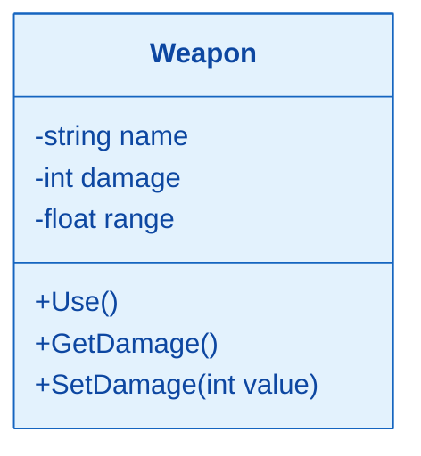
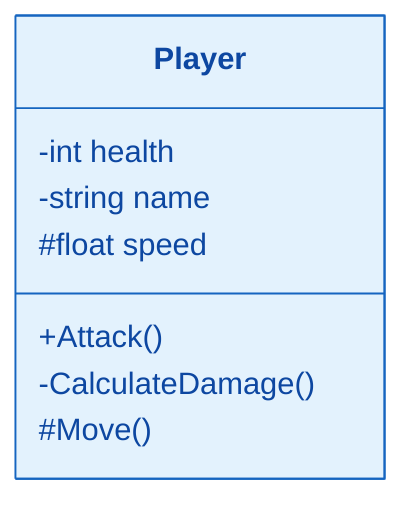
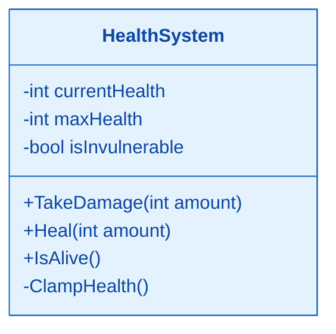
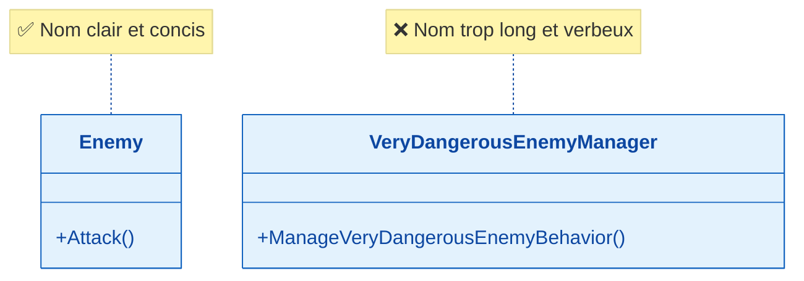
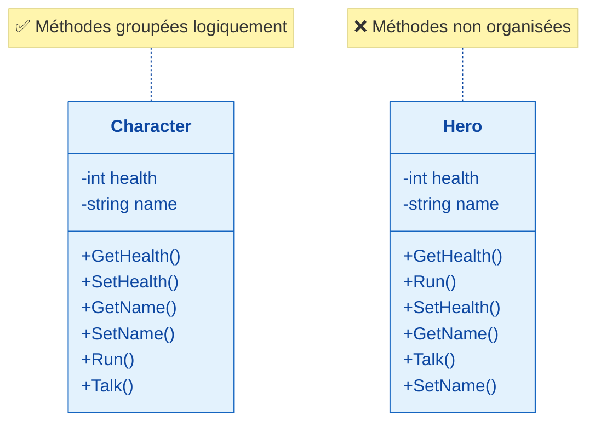
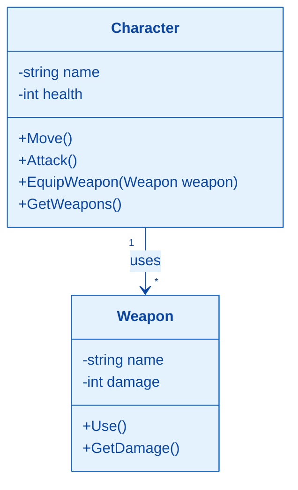
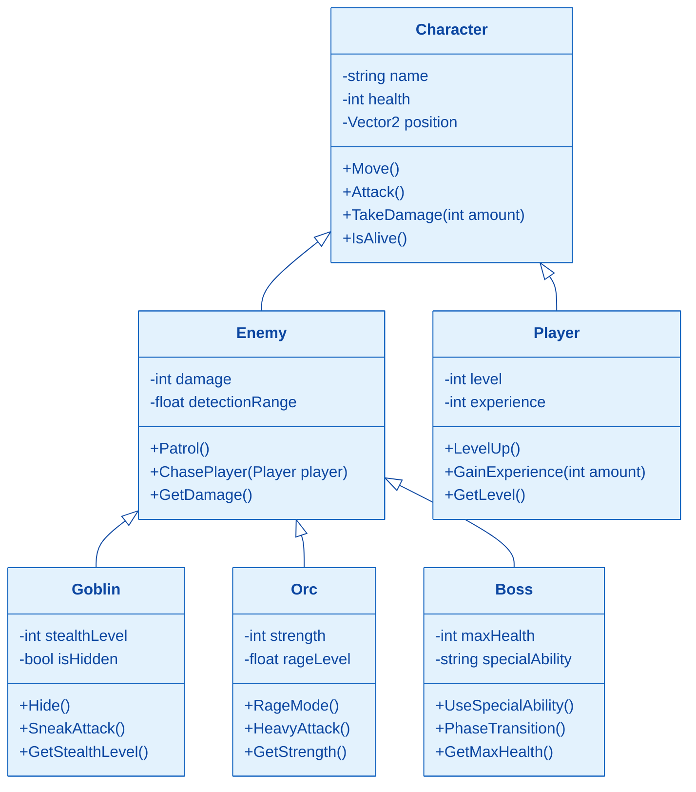
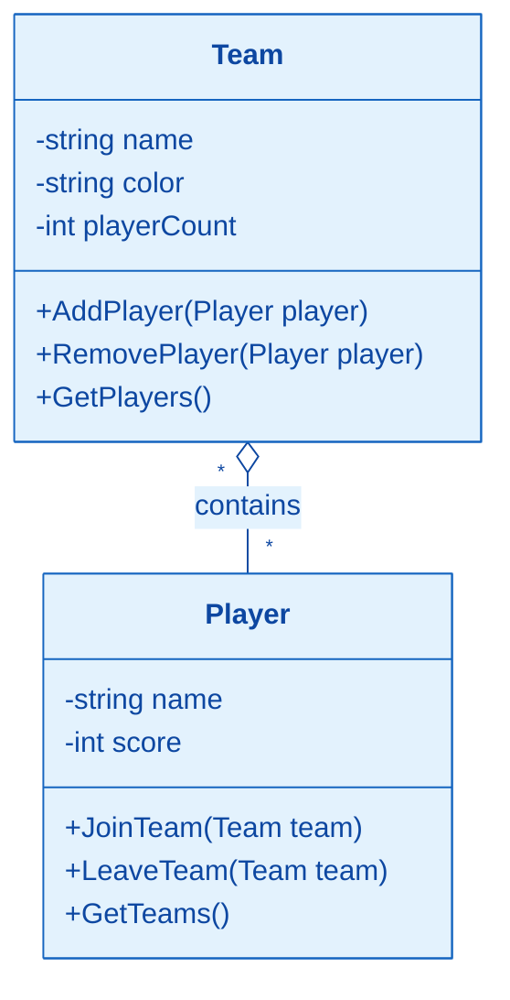
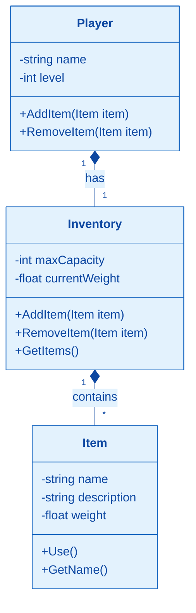

# 🎮 **Introduction à UML et Conception de Jeux**

## **Qu'est-ce que UML ?**
- **UML** est un langage pour dessiner nos idées de code
- On l'utilise pour **visualiser** notre jeu avant de le coder
- C'est comme faire le **plan** d'une maison avant de la construire

## **1. Classes et Objets**

### **Définition**
Une **classe** est un concept abstrait qui représente :
- Des éléments concrets (les personnages, les armes)
- Des éléments abstraits (un score, un dé dans un jeu)
- Des composants d'une application (les boutons, les images)
- Des structures informatiques (cliquer un bouton, un timer)
- Des éléments comportementaux (enregistrer une partie, une erreur dans un système)

Un **objet** (ou instance de la classe) est la concrétisation d'une classe :
- Mario est une instance de la classe Personnage
- Une arbalète est une instance de la classe Arme

### **La Différence Classe vs Objet**
- Une **classe** est comme un moule à gâteau
- Un **objet** est le gâteau qu'on crée avec ce moule

### Rappel : Classe vs Objet
Une classe est un modèle, un objet est une instance de ce modèle.



Exemple d'objets :
```csharp
Weapon sword = new Weapon("Épée", 10, 1.5f);
Weapon bow = new Weapon("Arc", 8, 10.0f);
```

## 2. Attributs et Méthodes

### Visibilité
- `+` public : accessible partout (hérité comme public)
- `-` private : accessible uniquement dans la classe (pas hérité)
- `#` protected : accessible dans la classe et ses héritiers (hérité comme protected, on verra l'héritage plus tard). Pas accésible depuis le code principal ou une classe qui n'hérite pas de cette classe



### Exemple Pratique : Système de Points de Vie



```csharp
public class HealthSystem 
{
    private int currentHealth;
    private int maxHealth;
    private bool isInvulnerable;

    public void TakeDamage(int amount) 
    {
        if (!isInvulnerable) 
        {
            currentHealth -= amount;
            ClampHealth();
        }
    }

    // méthode privée qui assure que la vie ne descende pas en dessous de 0 et ne monte pas au-dessus de la valeur maximale
    private void ClampHealth() 
    {
        currentHealth = Math.Max(0, Math.Min(currentHealth, maxHealth));
    }
    // etc....
}
```

## 3. Bonnes Pratiques UML

### Nommage des Classes


### Organisation des Méthodes



## 4. Les rélations

Dans le développement de jeux vidéo, **les classes peuvent être liées de différentes manières**. Nous allons voir tous ces types de rélations et des exemples d'implementation qui pourraient s'appliquer à de jeux.

### Association
Un `Character` peut utiliser plusieurs `Weapon` pour attaquer. C'est une relation simple entre deux classes sans propriété.



### Héritage
Un `Goblin` hérite d'un `Enemy` qui hérite lui-même d'un `Character`. C'est une relation de spécialisation où une classe hérite des propriétés et méthodes d'une autre.



### Agrégation
Un `Player` peut appartenir à plusieurs `Team` et un `Team` peut avoir plusieurs `Player`. C'est une relation de "appartient à" **où les objets peuvent exister indépendamment**.

**Exemple concret**: Dans **Mario Kart**, un joueur peut faire partie de plusieurs équipes (équipe rouge, équipe bleue, équipe verte) selon les modes de jeu, et une équipe peut avoir plusieurs joueurs. Les équipes existent même si aucun joueur ne les rejoint, et les joueurs existent même s'ils n'appartiennent à aucune équipe.

**Pourquoi c'est une agrégation et non une association ?** Dans une association simple, les objets sont liés temporairement (comme un personnage qui utilise une arme). Ici, il y a une relation de "appartient à" où les équipes peuvent exister indépendamment des joueurs, et les joueurs peuvent "appartenir" à plusieurs équipes.



### Composition
Un `Player` est composé d'un `Inventory` qui contient des `Item`. Si on détruit le `Player`, son inventaire et ses objets sont également détruits. C'est une relation de "est composé de" avec dépendance forte.


