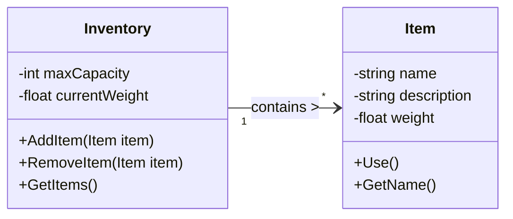
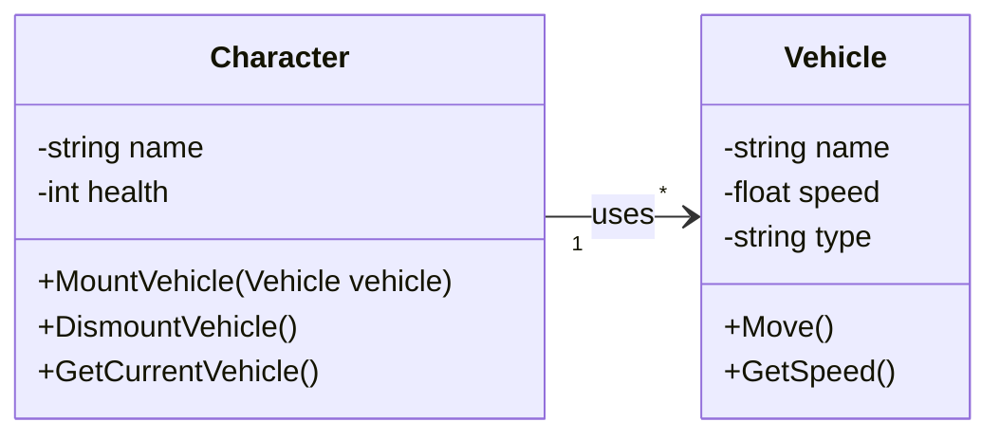
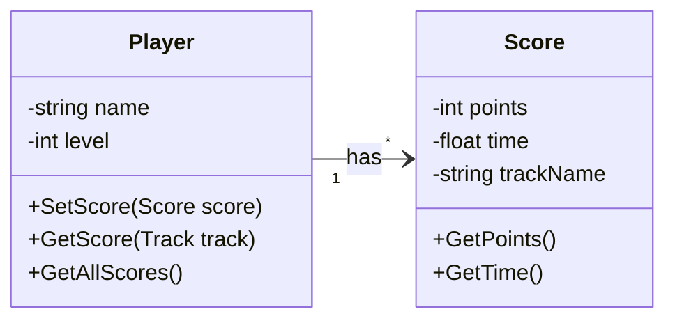
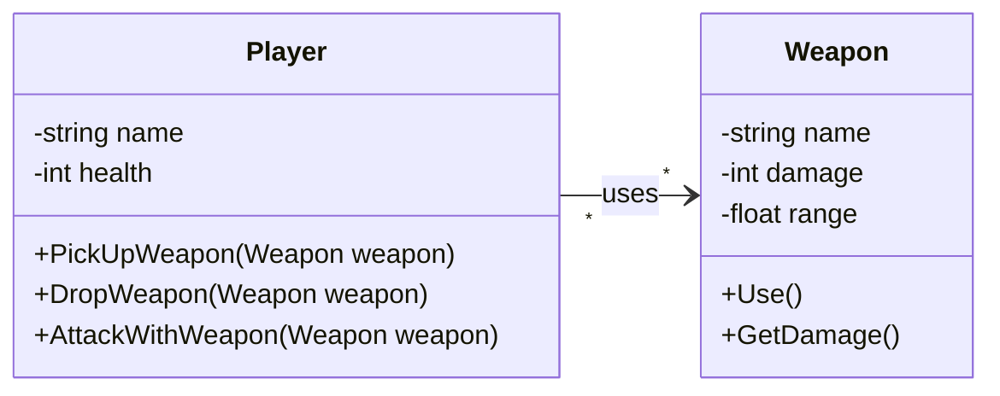
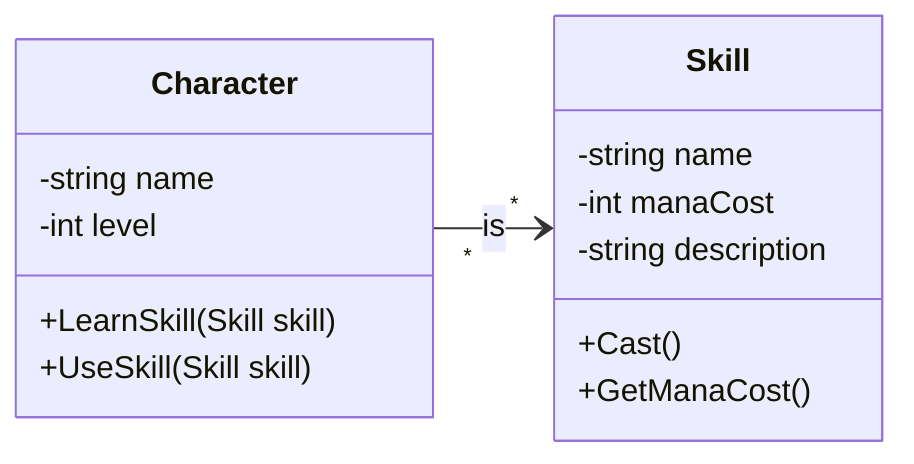
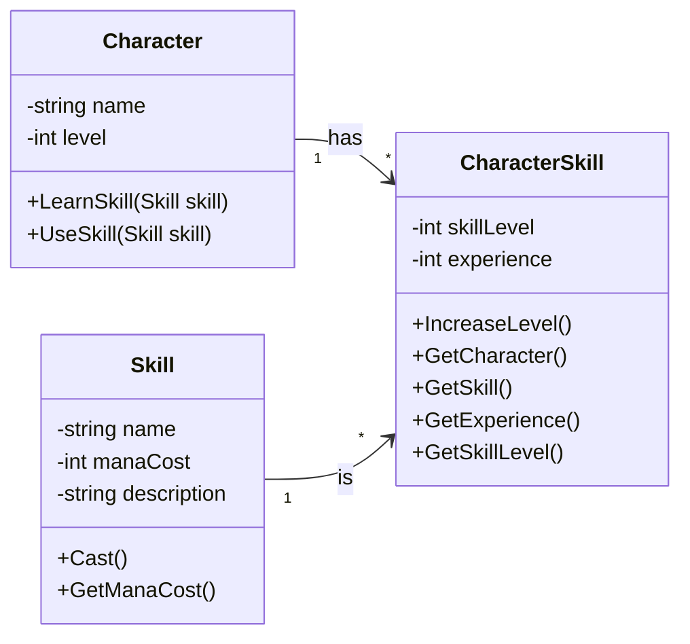
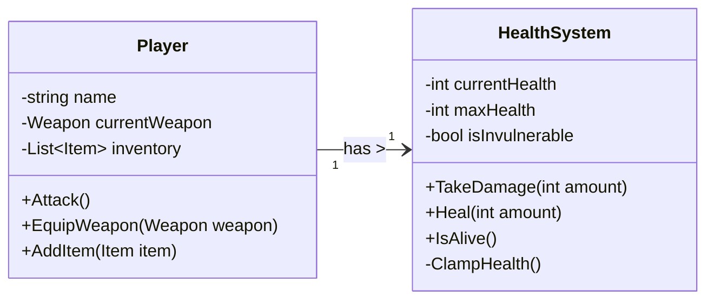
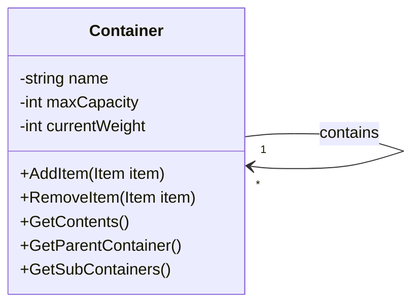
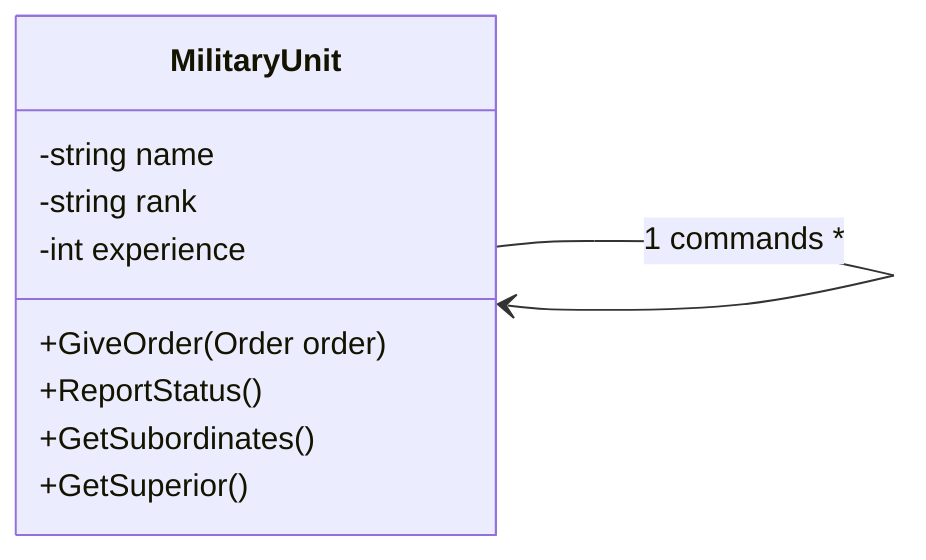

# 🎮 Chapitre 2. Relations entre Classes : Association

Ce chapitre se concentre spécifiquement sur les **relations d'association** entre classes. Une **association** représente une **relation** **entre** deux ou plusieurs **classes** qui décrit un **lien significatif** entre leurs instances, sans impliquer une relation de propriété ou d'héritage.

### Représentation en UML

### Caractéristiques principales des associations:

- **Nom**: Décrit **la nature de la relation** (par exemple "utilise" pour une association entre un Joueur et une Arme)
- **Direction**: Peut être **unidirectionnelle** (par exemple un Joueur utilise une Arme, mais l'Arme ne sait pas qui l'utilise) ou **bidirectionnelle** (par exemple un Joueur est lié à un Inventaire et vice-versa)
- **Multiplicité**: Indique **combien d'objets participent** de chaque côté de la relation (par exemple un Joueur utilise une Arme, mais un Joueur peut utiliser plusieurs Armes)
- **Rôles** (optionnel): Décrivent le rôle que joue chaque classe dans la relation (par exemple un Joueur est un utilisateur et une Arme est l'objet utilisé)

Dans ce diagramme:
- Un `Player` peut utiliser une `Weapon` (ou aucune)
- La flèche indique la direction de l'association
- L'étiquette "uses" décrit la nature de la relation
- La notation "1" et "0..1" indique la multiplicité

### Notation de Multiplicité en UML

Toutes les relations ne sont pas One-To-Many, et plein de cardinalités peuvent se présenter:

- **1**: Exactement un
- **0..1**: Zéro ou un (optionnel)
- **\***: N'importe quel nombre (zéro ou plus)
- **1..\***: Au moins un (un ou plus)
- **n..m** (ex: 2..5): Entre n et m instances (on remplace n et m par des chiffres)

## 🎲 Associations 1 à Plusieurs

### Exemple 1: Personnage et Véhicule

Dans de nombreux jeux, un personnage peut utiliser plusieurs véhicules différents.

**Exemple concret**: Dans **The Legend of Zelda**, Link peut monter un cheval, utiliser un bateau, ou voler avec un oiseau. Ces véhicules existent indépendamment du personnage et peuvent être utilisés par différents personnages.

### Exemple 2: Joueur et Scores

Un joueur peut avoir des scores différents dans différentes épreuves ou niveaux.

**Exemple concret**: Dans **Mario Kart**, un joueur peut avoir des scores différents sur chaque piste (Copa Champignon, Copa Étoile, etc.). Ces scores existent indépendamment du joueur et peuvent être comparés entre différents joueurs.

## Associations plusieurs à plusieurs sans attributs

### Exemple: Joueurs et Armes

Dans un jeu multijoueur, plusieurs joueurs peuvent utiliser la même arme (par exemple, une arme ramassée au sol), et un joueur peut utiliser plusieurs armes différentes au cours du jeu.

**Exemple concret**: Dans **Counter-Strike**, plusieurs joueurs peuvent ramasser la même arme au sol (comme un AK-47), et chaque joueur peut utiliser différentes armes au cours d'une partie.

## Associations plusieurs à plusieurs avec attributs

**Exemple :** Un personnage peut apprendre plusieurs compétences, et une compétence peut être apprise par plusieurs personnages. **La relation stocke des informations spécifiques comme le niveau de maîtrise**.

**Jeu de référence :** Final Fantasy VII - Los personajes pueden aprender diferentes habilidades (magia, técnicas especiales) y cada habilidad tiene un nivel de maestría específico para cada personaje.

La première idée qui nous vient à l'esprit est de représenter ainsi :

Mais imaginons que nous devons stocker le niveau que le personnage a acquis pour cette compétence (ex: niveau 3 en magie de feu). Dans quelle classe cette propriété irait-elle ? **Elle n'appartient à aucune des deux classes qui font partie de l'association**. **Elle n'existe que comme propriété du lien (association) entre un Personnage concret et une compétence complète**

Cette décomposition permet de stocker des informations spécifiques à chaque relation personnage-compétence, comme le niveau de compétence ou l'expérience accumulée, **qui ne pourraient pas être stockées dans les classes qui se trouvent à l'extrème de l'association** (`Character` et `Skill`)

## 🔗 Associations Un à Un

### Exemple: Joueur et Système de Santé

Chaque joueur a exactement un système de santé qui gère ses points de vie, et chaque système de santé appartient à exactement un joueur.

**Exemple concret**: Dans **Street Fighter II**, chaque personnage a son propre système de santé avec une barre de vie unique, et chaque barre de vie appartient à un seul personnage.

Cette relation 1 à 1 permet une séparation claire des responsabilités : le `Player` gère les actions du jeu tandis que le `HealthSystem` encapsule toute la logique de gestion de la santé.

### Avantages des Relations Un à Un

1. **Séparation des responsabilités**: Chaque classe se concentre sur un aspect spécifique
2. **Réutilisabilité**: Le système de santé peut être réutilisé pour différents types d'entités
3. **Maintenabilité**: Modifications du système de santé sans affecter la logique du joueur
4. **Testabilité**: Chaque composant peut être testé indépendamment

## 🔗 Associations Réflexives (Auto-associations)

### Exemple 1: Conteneurs Anidés dans l'Inventaire

Une **association réflexive** est une relation d'une classe avec elle-même. Elle permet de modéliser des structures hiérarchiques où les instances d'une même classe peuvent être liées entre elles.

**Exemple concret**: Dans un RPG, les conteneurs peuvent contenir d'autres conteneurs, créant une structure imbriquée. Une mochila peut contenir des boîtes, qui contiennent des sacs, qui contiennent des objets.

### Exemple 2: Hiérarchie Militaire

**Exemple concret**: Dans un jeu de stratégie militaire, les unités militaires peuvent avoir une hiérarchie de commandement. Un officier peut commander plusieurs subordonnés, et chaque subordonné a un seul supérieur direct.

### Caractéristiques de ces relations:

1. **Hiérarchie claire**: Chaque élément a un seul parent (sauf la racine)
2. **Structure arborescente**: Organisation logique et navigable
3. **Flexibilité**: Une même classe peut jouer différents rôles
4. **Réutilisabilité**: Le modèle s'adapte à différentes situations

### Avantages des associations réflexives:

1. **Modélisation de structures complexes**: Arbres, hiérarchies, réseaux
2. **Flexibilité**: Une même classe peut jouer différents rôles
3. **Réutilisabilité**: Le modèle s'adapte à différentes situations
4. **Maintenabilité**: Structure claire et organisée

### Objectif pédagogique
- Comprendre les associations one-to-many simples
- Gérer les workflows de missions
- Implémenter des systèmes de progression

## 🎯 Exercice : Système d'Athlétisme et Courses

### Contexte
Dans **Wii Sports**, les Miis (personnages du joueur) peuvent participer à plusieurs épreuves d'athlétisme (100m, 200m, saut en longueur, etc.). Un Mii peut participer à plusieurs épreuves, et une épreuve peut avoir plusieurs Miis participants.

### Relations à modéliser
1. **Mii ↔ Épreuve** : Un Mii peut participer à plusieurs épreuves, et une épreuve peut avoir plusieurs Miis
2. **Épreuve ↔ Épreuve** : Une épreuve peut être un prérequis pour une autre épreuve (ex: qualification pour finale)

### Exigences
- Créez les classes `Mii`, `Épreuve`, et `Participation`
- Implémentez les associations :
  - Mii ↔ Épreuve (many-to-many avec classe d'association)
  - Épreuve ↔ Épreuve (association réflexive)
- La classe d'association `Participation` doit contenir :
  - Temps réalisé
  - Position finale
  - Qualification (oui/non)
- Ajoutez des méthodes pour :
  - Inscrire un Mii à une épreuve
  - Enregistrer le résultat d'un Mii
  - Consulter les épreuves d'un Mii
  - Consulter les participants d'une épreuve

---

## 🎯 Exercice : Système de Potions dans The Witcher

### Contexte
Dans **The Witcher**, Geralt peut créer des potions en combinant différents ingrédients. Certaines potions peuvent être utilisées comme ingrédients pour créer des potions plus complexes. Par exemple, pour créer une "Potion de Force Supérieure", vous avez besoin de "Potion de Force" + "Essence de Troll". Mais la "Potion de Force" elle-même nécessite "Alcohest" + "Herbe de Griffon".

### Relations à modéliser
1. **Potion ↔ Potion** : Association réflexive où une potion peut être ingrédient d'autres potions
2. **Classe d'association** : Stocker les informations spécifiques à chaque relation potion-ingrédient

### Exigences
- Créez les classes `Potion` et `IngredientPotion`
- Implémentez l'association réflexive avec classe d'association :
  - Potion ↔ Potion (many-to-many avec classe d'association)
- La classe d'association `IngredientPotion` doit contenir :
  - Quantité nécessaire
  - Ordre d'ajout dans l'alambic
- Ajoutez des méthodes pour :
  - Ajouter un ingrédient à une potion
  - Obtenir la liste des ingrédients d'une potion
  - Trouver toutes les potions qui utilisent un ingrédient

