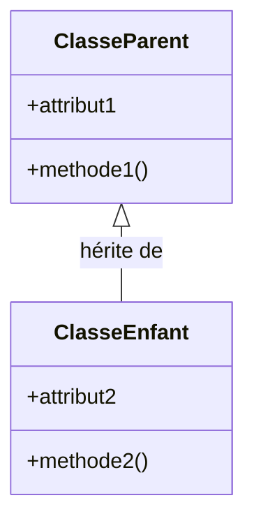
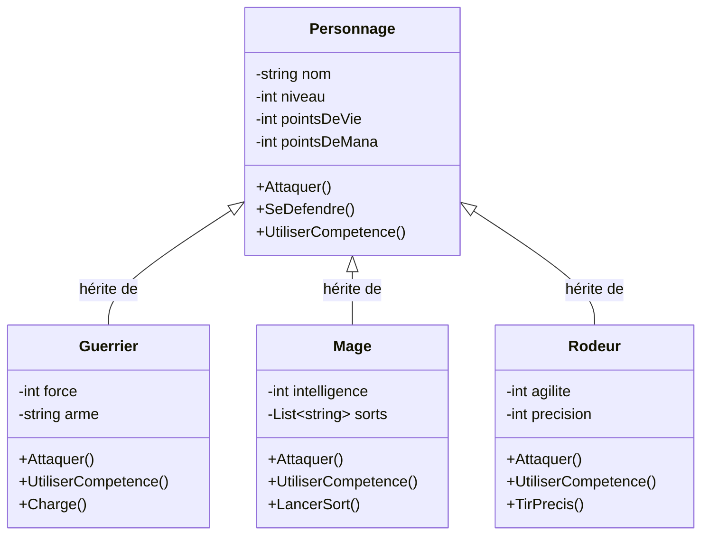
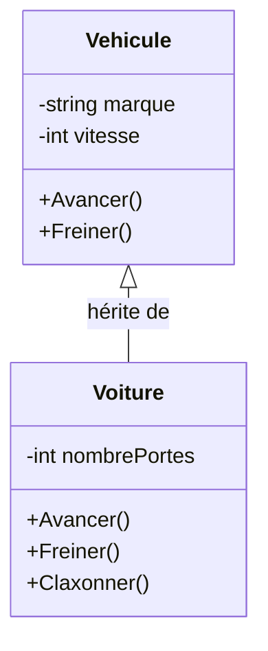
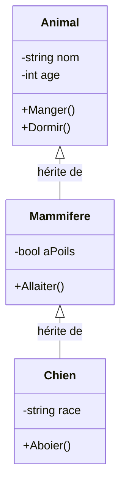
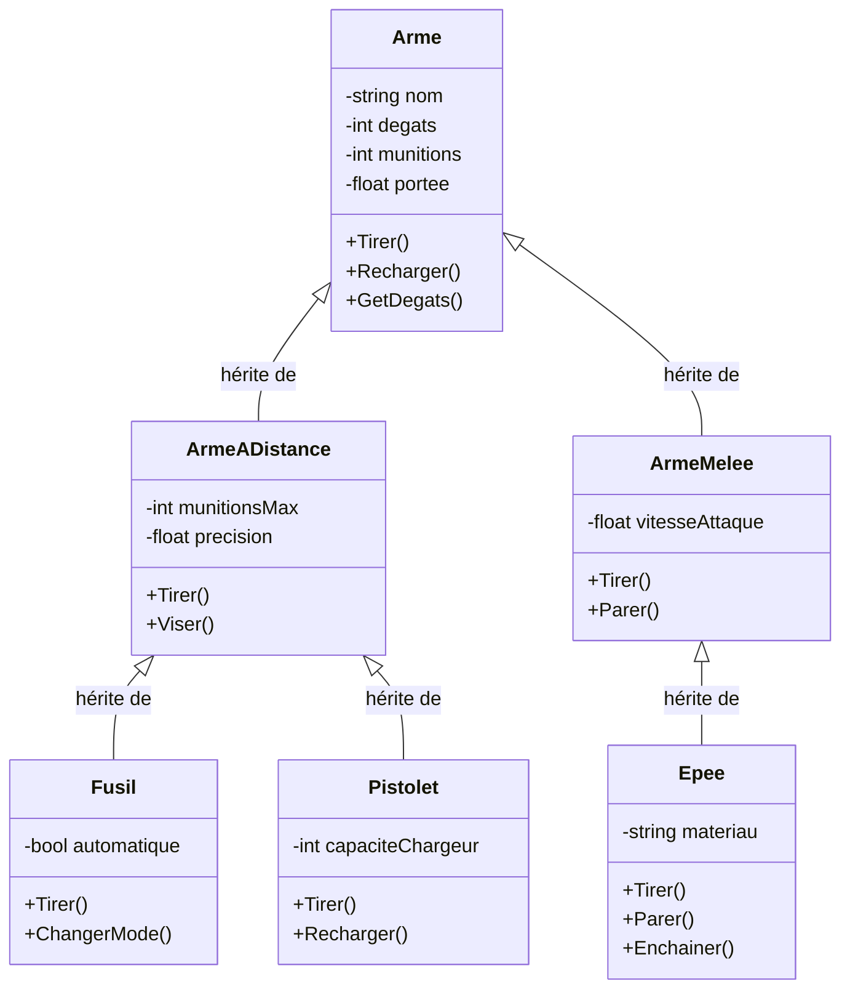
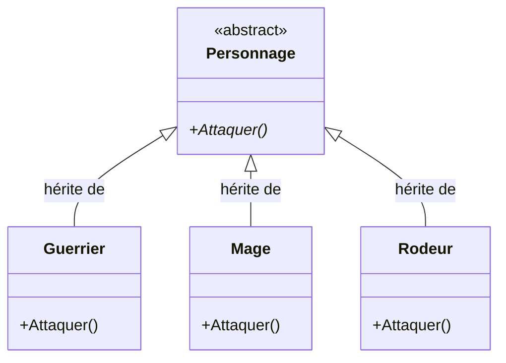
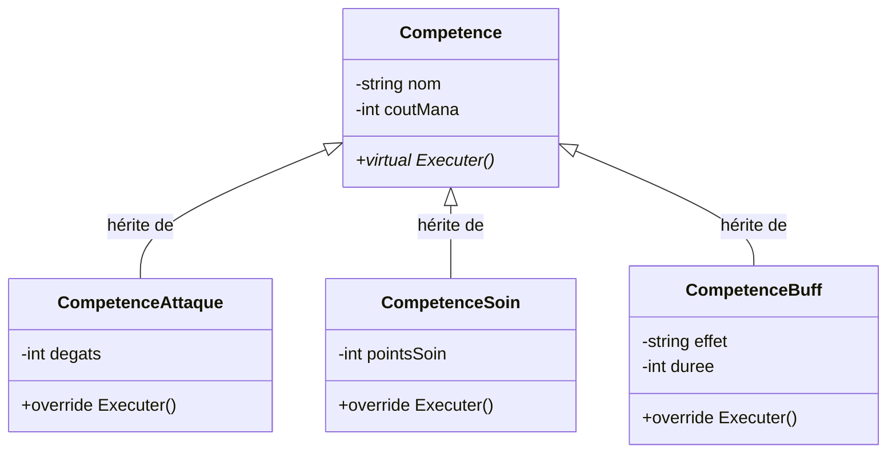
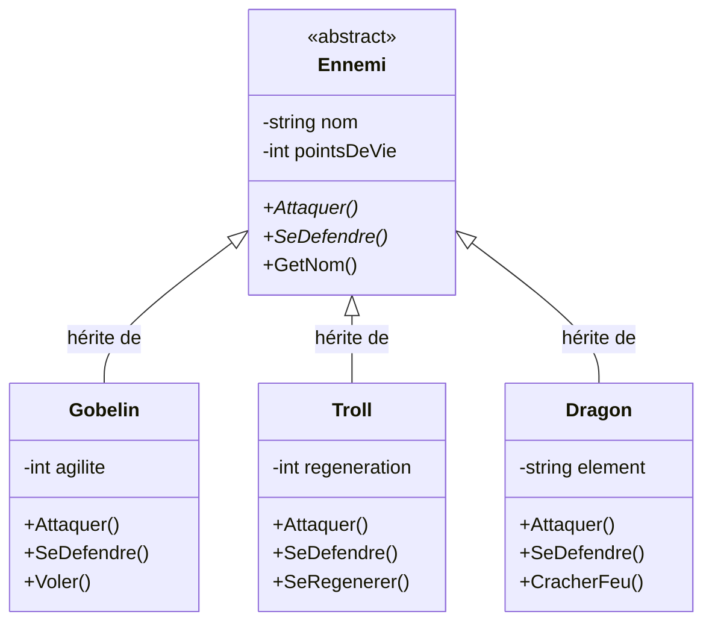
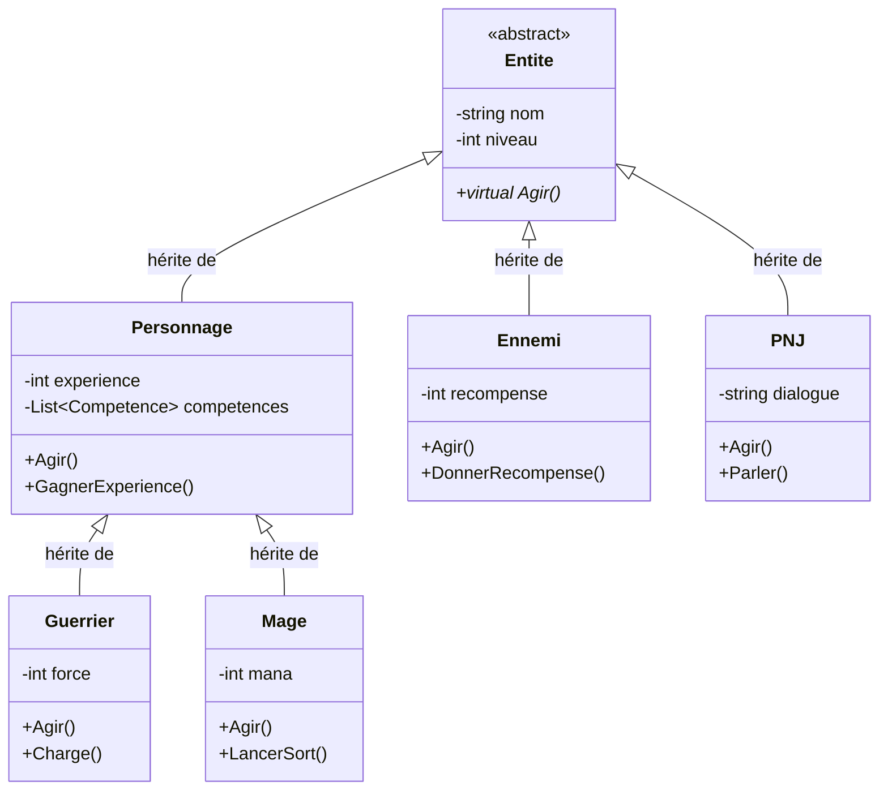

# Chapitre 4 : Héritage

## Objectifs
- Comprendre le concept d'héritage
- Modéliser les hiérarchies de classes
- Distinguer les méthodes et attributs hérités
- Utiliser le polymorphisme

---

## Qu'est-ce que l'Héritage ?

### Définition
L'**héritage** permet à une classe (classe **fille**) d'hériter des attributs et méthodes d'une autre classe (classe **mère** ou **parent**).

### Principe
- **Réutilisation** du code
- **Spécialisation** des comportements
- **Hiérarchie** logique entre classes

### Notation UML


---

## Exemple Fondamental : Personnages de Jeu

### Contexte
Dans un jeu de rôle, il existe différents types de personnages qui partagent des caractéristiques communes mais ont des comportements spécifiques.

**Jeu de référence** : Final Fantasy - Différents types de personnages avec des rôles spécifiques.

### Hiérarchie de Classes



### Implémentation : Structures de données

```csharp
public class Personnage
{
    protected string nom;
    protected int niveau;
    protected int pointsDeVie;
    protected int pointsDeMana;
    
    public virtual void Attaquer() { /* logique commune */ }
    public virtual void SeDefendre() { /* logique commune */ }
    public virtual void UtiliserCompetence() { /* logique commune */ }
}

public class Guerrier : Personnage
{
    private int force;
    private string arme;
    
    public override void Attaquer() { /* logique spécifique au guerrier */ }
    public override void UtiliserCompetence() { /* logique spécifique */ }
    public void Charge() { /* méthode spécifique */ }
}
```

---

## Types d'Héritage

### 1. Héritage Simple
Une classe fille hérite d'une seule classe mère.



### 2. Hiérarchie Multi-niveaux
Plusieurs niveaux d'héritage.



---

## Exemple : Système d'Armes

### Contexte
Dans un jeu d'action, différents types d'armes partagent des caractéristiques communes mais ont des comportements spécifiques.

**Jeu de référence** : Call of Duty - Différents types d'armes avec des mécaniques spécifiques.

### Hiérarchie d'Armes



### Implémentation : Structures de données

```csharp
public class Arme
{
    protected string nom;
    protected int degats;
    protected int munitions;
    protected float portee;
    
    public virtual void Tirer() { /* logique commune */ }
    public virtual void Recharger() { /* logique commune */ }
    public int GetDegats() { return degats; }
}

public class ArmeADistance : Arme
{
    protected int munitionsMax;
    protected float precision;
    
    public override void Tirer() { /* logique spécifique */ }
    public virtual void Viser() { /* logique commune aux armes à distance */ }
}

public class Fusil : ArmeADistance
{
    private bool automatique;
    
    public override void Tirer() { /* logique spécifique au fusil */ }
    public void ChangerMode() { automatique = !automatique; }
}
```

---

## Polymorphisme

### Définition
Le **polymorphisme** permet d'utiliser une classe fille partout où une classe mère est attendue.

### Exemple Pratique

```csharp
// Liste de personnages (polymorphisme)
List<Personnage> personnages = new List<Personnage>();
personnages.Add(new Guerrier());
personnages.Add(new Mage());
personnages.Add(new Rodeur());

// Chaque personnage utilise sa propre implémentation
foreach (Personnage p in personnages)
{
    p.Attaque(); // Polymorphisme : chaque type utilise sa méthode
}
```

### Diagramme UML du Polymorphisme



---

## Méthodes Virtuelles et Override

### Méthodes Virtuelles
- Permettent aux classes filles de **redéfinir** le comportement
- Utilisent le mot-clé `virtual` dans la classe mère
- Utilisent le mot-clé `override` dans la classe fille

### Exemple : Système de Compétences



### Implémentation : Structures de données

```csharp
public class Competence
{
    protected string nom;
    protected int coutMana;
    
    public virtual void Executer() 
    { 
        Console.WriteLine("Compétence de base"); 
    }
}

public class CompetenceAttaque : Competence
{
    private int degats;
    
    public override void Executer() 
    { 
        Console.WriteLine($"Attaque infligeant {degats} dégâts"); 
    }
}

public class CompetenceSoin : Competence
{
    private int pointsSoin;
    
    public override void Executer() 
    { 
        Console.WriteLine($"Soin de {pointsSoin} points de vie"); 
    }
}
```

---

## Classes Abstraites

### Définition
Une **classe abstraite** ne peut pas être instanciée directement. Elle sert de modèle pour les classes filles.

### Exemple : Système d'Ennemis



### Implémentation : Structures de données

```csharp
public abstract class Ennemi
{
    protected string nom;
    protected int pointsDeVie;
    
    public abstract void Attaquer();  // Méthode abstraite
    public abstract void SeDefendre(); // Méthode abstraite
    
    public string GetNom() { return nom; } // Méthode concrète
}

public class Gobelin : Ennemi
{
    private int agilite;
    
    public override void Attaquer() 
    { 
        Console.WriteLine("Le gobelin attaque rapidement"); 
    }
    
    public override void SeDefendre() 
    { 
        Console.WriteLine("Le gobelin esquive"); 
    }
    
    public void Voler() { /* logique spécifique */ }
}
```

---

## Avantages de l'Héritage

### ✅ Avantages
1. **Réutilisation du code** : Évite la duplication
2. **Hiérarchie logique** : Organisation claire des concepts
3. **Polymorphisme** : Flexibilité dans l'utilisation
4. **Extensibilité** : Facile d'ajouter de nouvelles classes
5. **Maintenance** : Modifications centralisées

### ❌ Inconvénients
1. **Couplage fort** : Les classes filles dépendent de la mère
2. **Héritage multiple** : Complexité (non supporté en C#)
3. **Violation du principe de substitution** : Si mal utilisé
4. **Hiérarchie rigide** : Difficile à modifier

---

## Bonnes Pratiques

### ✅ À Faire
- Utiliser l'héritage pour une **relation "est-un"**
- Créer des hiérarchies **logiques et cohérentes**
- Utiliser des **classes abstraites** pour les concepts généraux
- **Documenter** les méthodes virtuelles
- Tester le **polymorphisme**

### ❌ À Éviter
- Hériter pour **réutiliser du code** uniquement
- Créer des hiérarchies **trop profondes** (> 3 niveaux)
- **Violer le principe de substitution** de Liskov
- **Surcharger** les méthodes sans raison valable
- **Ignorer** les méthodes abstraites

---

## Exemple Complet : Système de Jeu

### Contexte
Modélisation d'un système de jeu complet avec différents types d'entités.

**Jeu de référence** : World of Warcraft - Système complexe avec héritage multiple.

### Hiérarchie Complète



### Implémentation : Structures de données

```csharp
public abstract class Entite
{
    protected string nom;
    protected int niveau;
    
    public abstract void Agir();
}

public class Personnage : Entite
{
    protected int experience;
    protected List<Competence> competences;
    
    public override void Agir() 
    { 
        Console.WriteLine("Le personnage agit"); 
    }
    
    public virtual void GagnerExperience() 
    { 
        experience += 10; 
    }
}

public class Guerrier : Personnage
{
    private int force;
    
    public override void Agir() 
    { 
        Console.WriteLine("Le guerrier attaque avec sa force"); 
    }
    
    public override void GagnerExperience() 
    { 
        base.GagnerExperience(); // Appel de la méthode parent
        force += 1; // Bonus spécifique au guerrier
    }
}
```

---

## Résumé

### Concepts Clés
1. **Héritage** : Relation "est-un" entre classes
2. **Polymorphisme** : Utilisation flexible des objets
3. **Classes abstraites** : Modèles pour les classes filles
4. **Méthodes virtuelles** : Redéfinition du comportement

### Applications dans les Jeux
- **Types de personnages** : Guerrier, Mage, Rôdeur
- **Systèmes d'armes** : Fusil, Pistolet, Épée
- **Types d'ennemis** : Gobelin, Troll, Dragon
- **Systèmes de compétences** : Attaque, Soin, Buff

### Prochaines Étapes
- **Interfaces** : Contrats sans implémentation
- **Composition** : Alternative à l'héritage
- **Patterns de conception** : Utilisation avancée 