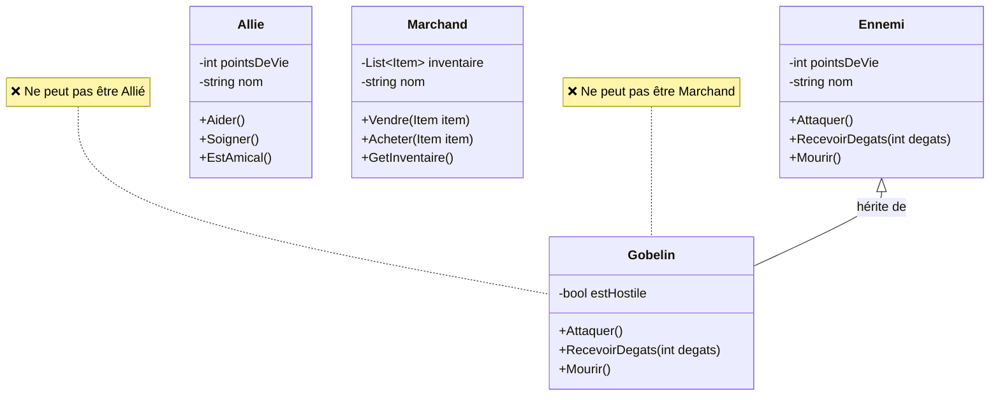
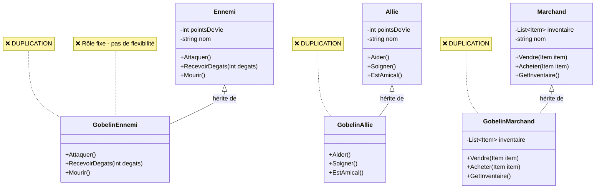
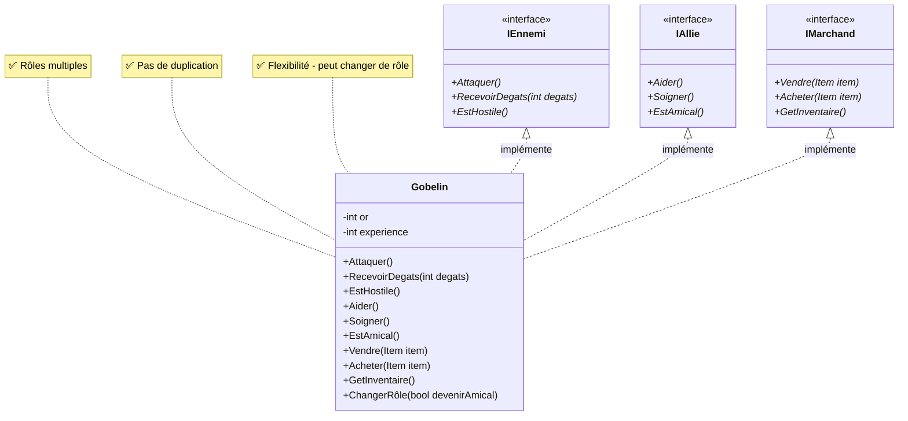
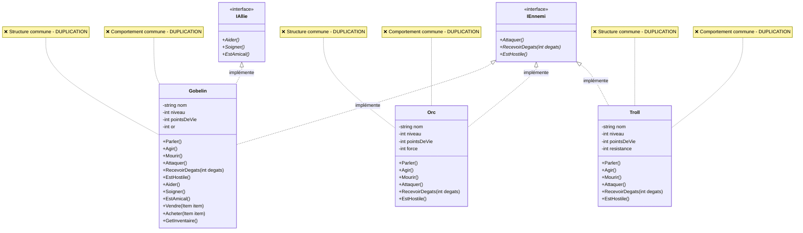
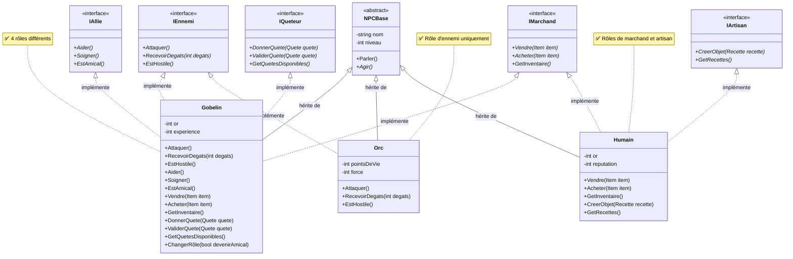

# Chapitre 5 : Interfaces - Résoudre le Problème de l'Héritage Multiple

## Objectifs
- Comprendre **pourquoi** les interfaces existent
- Identifier les **limitations** de l'héritage simple
- Modéliser des **contrats** sans implémentation
- Utiliser les interfaces pour **éviter** l'héritage multiple

---

## Le Problème : Limitation de l'Héritage Simple

### 🚨 Situation Réelle
Dans **World of Warcraft**, les gobelins peuvent avoir différents rôles selon le contexte :
- **Ennemi** : Attaque les joueurs dans certaines zones
- **Allié** : Aide les joueurs dans d'autres zones
- **Marchand** : Vend des objets aux joueurs
- **Artisan** : Crée des objets pour les joueurs

### 💡 Le Problème avec l'Héritage Simple
En C#, une classe ne peut hériter que d'**une seule** classe mère. Comment modéliser un gobelin qui peut être à la fois ennemi ET allié ?

```csharp
// ❌ IMPOSSIBLE en C# - Héritage multiple non supporté
public class Gobelin : Ennemi, Allie  // ❌ ERREUR DE COMPILATION
{
    // ...
}
```

### 🎯 Le Dilemme - Diagramme UML

#### ❌ APPROCHE 1 : Hériter d'Ennemi seulement


#### ❌ APPROCHE 2 : Classes séparées (Duplication)


---

## La Solution : Interfaces

### 🎯 Qu'est-ce qu'une Interface ?
Une **interface** définit un **contrat** (méthodes et propriétés) qu'une classe doit respecter, **sans fournir d'implémentation**. Elle résout le problème de l'héritage multiple.

### ✅ Avec Interfaces - Diagramme UML



### Avantages Immédiats
- **Héritage multiple** : Une classe peut implémenter plusieurs interfaces
- **Flexibilité** : Un gobelin peut changer de rôle dynamiquement
- **Pas de duplication** : Une seule classe pour tous les rôles
- **Contrats clairs** : Chaque interface définit exactement ce qui doit être fait

---

## Le Problème : Structure ET Comportement Communs

### 🚨 Situation Réelle
Dans un jeu, nous avons des créatures qui partagent **structure ET comportement communs** :
- **Structure commune** : Toutes les créatures ont `nom`, `niveau`, `pointsDeVie`
- **Comportement commun** : Toutes les créatures peuvent `parler`, `agir`, `mourir`
- **Rôles multiples** : Une créature peut être ennemie ET alliée ET marchande

### 💡 Le Problème - Diagramme UML



### 💡 Le Problème
**Situation :** Nous avons des créatures qui partagent **structure ET comportement communs**, mais qui peuvent aussi avoir **rôles multiples**.

**❌ Problème avec les interfaces seules :**

```csharp
// Chaque classe redéfinit TOUT depuis zéro
public class Gobelin : IEnnemi, IAllie, IMarchand
{
    // ❌ DUPLICATION de structure
    private string nom;
    private int niveau;
    private int pointsDeVie;
    private int or;
    
    // ❌ DUPLICATION de comportement
    public void Parler() { /* logique commune */ }
    public void Agir() { /* logique commune */ }
    public void Mourir() { /* logique commune */ }
    
    // Méthodes spécifiques aux interfaces
    public void Attaquer() { /* spécifique */ }
    public void Aider() { /* spécifique */ }
    public void Vendre(Item item) { /* spécifique */ }
}

public class Orc : IEnnemi
{
    // ❌ MÊME DUPLICATION
    private string nom;
    private int niveau;
    private int pointsDeVie;
    private int force;
    
    public void Parler() { /* même logique */ }
    public void Agir() { /* même logique */ }
    public void Mourir() { /* même logique */ }
    public void Attaquer() { /* spécifique */ }
}
```

**🔍 Problèmes identifiés :**
1. **Duplication de Structure** : Attributs identiques dans toutes les classes (`nom`, `niveau`, `pointsDeVie`)
2. **Duplication de Comportement** : Méthodes communes redéfinies partout (`Parler`, `Agir`, `Mourir`)
3. **Pas de réutilisation** : Chaque classe réinvente la roue
4. **Maintenance difficile** : Changer la logique commune = modifier toutes les classes

---

## La Solution : Classes Abstraites + Interfaces

### 🎯 Approche Hybride
Combiner les **classes abstraites** (pour le comportement commun) avec les **interfaces** (pour les contrats multiples).

### ✅ Solution Complète - Diagramme UML


### 🏆 Avantages de l'Approche Hybride
- **Réutilisation** : Comportement commun hérité de la classe abstraite
- **Flexibilité** : Rôles multiples via les interfaces
- **DRY** : Pas de duplication de code
- **Évolutivité** : Facile d'ajouter de nouveaux rôles

---

## Exemple Pratique : Système de Quêtes

### 🎮 Contexte Réel
Dans **Skyrim**, les NPCs peuvent avoir plusieurs rôles :
- **Ennemi** : Attaque le joueur
- **Allié** : Aide le joueur
- **Marchand** : Vend des objets
- **Quêteur** : Donne des quêtes
- **Artisan** : Crée des objets

### 🚨 Problèmes à Résoudre
1. **Rôles multiples** : Un NPC peut être marchand ET quêteur
2. **Comportements communs** : Tous les ennemis attaquent de la même façon
3. **Flexibilité** : Un NPC peut changer de rôle selon les conditions

### ✅ Solution Complète - Diagramme UML




### 🎯 Utilisation Polymorphique
```csharp
// ✅ Code flexible qui s'adapte aux rôles
List<NPCBase> npcs = new List<NPCBase>();
npcs.Add(new Gobelin("Grik"));
npcs.Add(new Orc("Grom"));

foreach (NPCBase npc in npcs)
{
    npc.Agir();  // Chaque type utilise sa propre implémentation
    
    // ✅ Vérification de rôles
    if (npc is IMarchand marchand)
    {
        marchand.Vendre(new Item("Épée"));
    }
    
    if (npc is IQueteur queteur)
    {
        queteur.DonnerQuete(new Quete("Tuer les rats"));
    }
}
```

---

## Comparaison : Héritage vs Interfaces

### 📊 Tableau Comparatif

| Aspect | Héritage | Interfaces |
|--------|----------|------------|
| **Héritage multiple** | ❌ Non supporté | ✅ Supporté |
| **Implémentation** | ✅ Code fourni | ❌ Contrat seulement |
| **Réutilisation** | ✅ Héritage de code | ❌ Pas de code |
| **Flexibilité** | ❌ Relation fixe | ✅ Rôles multiples |
| **Contrats** | ❌ Implicite | ✅ Explicite |

### 🎯 Quand Utiliser Chaque Approche

#### ✅ Utiliser l'Héritage quand :
- **Relation "est-un"** claire
- **Comportement commun** à partager
- **Hiérarchie** logique et stable
- Exemple : `Gobelin` est un `Ennemi`

#### ✅ Utiliser les Interfaces quand :
- **Rôles multiples** nécessaires
- **Contrats** sans implémentation
- **Flexibilité** requise
- Exemple : `Gobelin` peut être `IEnnemi`, `IAllie`, `IMarchand`

#### ✅ Utiliser l'Approche Hybride quand :
- **Comportement commun** + **rôles multiples**
- **Réutilisation** + **flexibilité**
- Exemple : `Gobelin` hérite de `EnnemiBase` + implémente `IAllie`, `IMarchand`

---

## Résumé : Problèmes et Solutions

### 🎯 Règles Pratiques
- **Interface** : "Peut faire" (contrat)
- **Classe Abstraite** : "Est" + comportement commun
- **Héritage Multiple** : Via interfaces (ou interfaces + une classe), pas via classes car impossible
- **Flexibilité** : Interfaces pour rôles dynamiques

